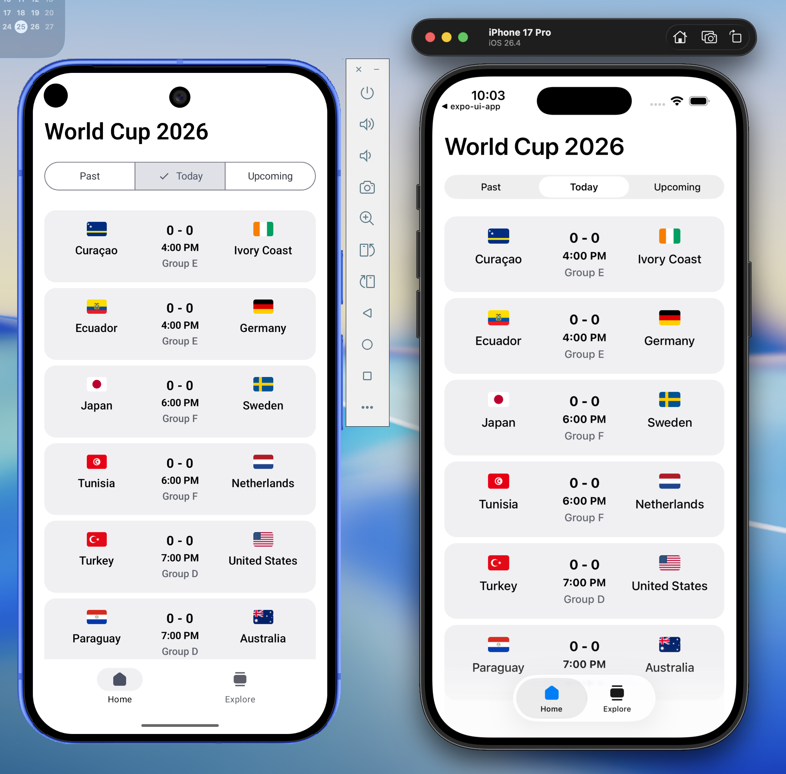

# My Cup ⚽️ — FIFA World Cup 2026

A small, focused React Native app that shows **FIFA World Cup 2026** matches grouped into **Past**, **Today**, and **Upcoming** — with live scores for finished matches. Built with Expo, Expo Router, and Zustand.

<p align="center">
  
</p>

## Features

- 🗂️ **Segmented control** to switch between Past / Today / Upcoming matches
- 🧮 **Real scores** for finished matches (falls back to `0 - 0` before kickoff)
- 🏳️ Team flags, names, kickoff time, and group for every match
- 🌓 Light & dark mode
- 📱 Runs on iOS, Android, and web

## How it works

- **Data** comes from the live [worldcup26.ir](https://worldcup26.ir) API (`/get/games`, `/get/teams`), based on [rezarahiminia/worldcup2026](https://github.com/rezarahiminia/worldcup2026). Responses are fully typed.
- **State** is managed with [Zustand](https://github.com/pmndrs/zustand). On load, matches are joined with team data, parsed, and pre-grouped into `past` / `today` / `upcoming` buckets relative to the current day.
- **UI** uses [`@expo/ui`](https://docs.expo.dev/versions/latest/sdk/ui/)'s native segmented control on top of [Expo Router](https://docs.expo.dev/router/introduction/).

```
src/
├── app/                 # Expo Router screens (home = segmented match lists)
├── components/          # MatchCard, MatchList, themed primitives
├── lib/                 # API layer + match parsing / bucketing utils
├── store/               # Zustand store
└── types/               # Typed API + domain models
```

## Getting started

```bash
# install dependencies
npm install

# run it
npm run ios      # or: npm run android / npm run web
```

> Requires a [development build](https://docs.expo.dev/develop/development-builds/introduction/) because of the native `@expo/ui` components.

## Tech stack

Expo SDK 56 · Expo Router · React Native 0.85 · Zustand · @expo/ui · TypeScript

---

<table>
  <tr>
    <td width="120" align="center" valign="middle">
      <h1>📘</h1>
    </td>
    <td valign="middle">
      <h3>Want to build & ship apps like this with AI?</h3>
      <p><b>From Idea to App Store with Claude Code</b> — learn the mental models and the full development lifecycle to build, deploy, and maintain real mobile apps with Claude Code. No coding required.</p>
      <p>👉 <a href="https://cwb.sh/book"><b>Learn more →</b></a></p>
    </td>
  </tr>
</table>

---

Built by [Beto](https://codewithbeto.dev) · [YouTube](https://cwb.sh/youtube) · [X](https://x.com/betomoedano) · [Discord](https://cwb.sh/discord)
